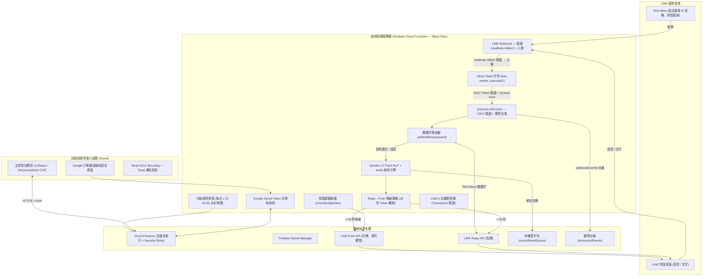

# 家庭秘書 (Household Secretary) 網頁應用程式 — 系統開發架構計畫書 (v3.0 定稿版)

> **版本**：v3.0.0 (Final)
> **更新日期**：2026-07-24
> **核心變更（基於 v2.9 整體自評，共修正 20 個問題）**：
>
> **安全修正**
> - **Sec-1**：`validateLineSignature` 改對 `req.rawBody`（原始 bytes）計算 HMAC，消除 JSON.stringify 字元順序不確定性
> - **Sec-2**：`isValidCloudTasksRequest` 改用 `google-auth-library` 驗證 OIDC token，消除只檢查 header 字串可被偽造的漏洞
> - **Sec-3**：`verifyBindingCode` 改用 Firestore Transaction，消除 attempts 計數的競態條件
> - **Sec-4**：補 `bindingCodes` 與 `processedEvents` 集合的 Security Rules；補 Admin SDK 繞過說明
>
> **邏輯修正**
> - **Log-1**：`regexFallback` 規則順序對調（店家採買優先於金額記帳），消除語意衝突
> - **Log-2**：`markAsBought` 路徑從根集合 `shoppingItems/{id}` 修正為 `families/{familyId}/shoppingItems/{id}`
> - **Log-3**：補齊冪等去重（`processedEvents/{webhookEventId}`），Cloud Tasks 重試不再重複記帳
>
> **未定義函式補齊**
> - **Def-1**：`getFamilyIdByLineUserId`（collectionGroup 查詢）
> - **Def-2**：`saveToUnconfirmedQueue`
> - **Def-3**：`buildConfirmationCard`
> - **Def-4**：`fetchTodayScheduleCard`、`fetchShoppingListCard`、`fetchAccountBalanceCard`（Rich Menu 卡片生成）
> - **Def-5**：`getBindingCode`、`linkLineUser`（配對碼輔助函式，整合進 Transaction）
> - **Def-6**：`addExpenseRecord`（消費紀錄新增）
>
> **索引與依賴**
> - **Idx-1**：`firestore.indexes.json` 補 `members` collectionGroup 索引（供 `getFamilyIdByLineUserId`）
> - **Dep-1**：Onboarding 補齊 `npm install` 指令（`@google-cloud/tasks`, `@google/generative-ai`, `google-auth-library`, `googleapis`, `zustand`）

---

## 📋 目錄

1. [專案背景與核心理念](#1-專案背景與核心理念)
2. [系統整體架構圖](#2-系統整體架構圖)
3. [技術選型與架構部署](#3-技術選型與架構部署)
4. [四大專業模組與職責分工](#4-四大專業模組與職責分工)
5. [七大工程實務防護機制](#5-七大工程實務防護機制)
6. [NLP 解析引擎、Prompt 規格與 Fallback 策略](#6-nlp-解析引擎prompt-規格與-fallback-策略)
7. [完整 TypeScript 資料模型定義](#7-完整-typescript-資料模型定義)
8. [測試策略](#8-測試策略)
9. [新手環境建置 Onboarding 指南](#9-新手環境建置-onboarding-指南)
10. [UI 錯誤處理策略](#10-ui-錯誤處理策略)
11. [分階段開發與驗收標準 (Definition of Done)](#11-分階段開發與驗收標準-definition-of-done)
12. [非功能性需求 (NFR)](#12-非功能性需求-nfr)
13. [CI/CD 部署流程](#13-cicd-部署流程)

---

## 1. 專案背景與核心理念

在家庭生活中，**太太/家庭主管理者**通常是承擔最多雜務記憶與調度的關鍵人物。本專案以 **「極速高效捕捉」** 與 **「零認知負擔」** 為核心哲學，打造一套結合 **網頁控制台 (Web Dashboard)**、**Firebase 雲端後端** 與 **LINE 專屬管家 (LINE Rich Menu + Gemini NLP Engine)** 的智慧家庭秘書系統。

### 核心特色
- ⚡ **多項目批次語音/文字捕捉**：一次輸入多項採買、行程與記帳，Gemini 1.5 Flash 自動拆解
- 🎛️ **LINE 圖文選單 (Rich Menu)**：底部常駐 4 宮格，一鍵查詢，使用免費 Reply API
- 🛒 **特定店家採買過濾與一鍵交辦**：自動區分好市多、全聯、家樂福與傳統市場
- 📅 **Google 行事曆雙軌同步**：iCal 訂閱（零設定）與 Google OAuth（完整雙向）
- 💰 **專業家庭財務工具**：多帳戶、月結快照加速動態餘額計算、月度預算警報
- 📲 **事件觸發型推播**：僅預算超額與交辦通知使用 Push API，月用量保守估算 < 120 則

---

## 2. 系統整體架構圖



---

## 3. 技術選型與架構部署

| 架構分層 | 使用技術 / 工具 | 選型考量與說明 |
| :--- | :--- | :--- |
| **前端框架** | Vite + React (TypeScript) | 高效 SPA、強型別防錯、元件化快重構 |
| **視覺與樣式** | Vanilla Modern CSS | CSS Custom Properties、Glassmorphism、Flexbox/Grid，雙主題切換 |
| **身份驗證** | Firebase Authentication | Google 帳號一鍵登入，UID 作為 Firestore 資料隔離依據 |
| **後端服務** | Firebase Cloud Functions **(Blaze Plan)** | 必須升級 Blaze 才能呼叫外部 API（LINE、Gemini、Cloud Tasks） |
| **非同步佇列** | Google Cloud Tasks | 保證 LINE 事件 at-least-once + 指數退避重試，搭配 `processedEvents` 去重實現 effectively-once |
| **NLP 解析引擎** | Google Gemini 1.5 Flash API | 免費額度 15 RPM / 1500 RPD，支援 Text + Audio Multimodal |
| **資料庫** | Cloud Firestore | 即時同步、Offline Persistence、Security Rules 依 UID 隔離 |
| **金鑰管理** | Firebase Secret Manager | LINE / Gemini Keys 存於後端，前端不可見 |
| **部署方案** | Vercel（前端）+ Firebase（後端） | GitHub 推送自動觸發 CI/CD |
| **狀態管理** | Zustand | 輕量無 Boilerplate |
| **測試框架** | Vitest + Firebase Emulator Suite | 單元測試 + 整合測試 |

### ⚠️ Firebase Blaze Plan 必讀
Spark Plan 禁止 Cloud Functions 呼叫外部 API，**必須升級 Blaze**。綁信用卡但家庭用量在免費配額內（預估 $0/月）。設定每月 $1 USD 費用警報。

### ⚠️ Admin SDK 繞過 Security Rules
Cloud Functions 使用 **Firebase Admin SDK**，Admin SDK **完全繞過 Firestore Security Rules**，直接以最高權限存取。Security Rules 只保護來自前端 SDK 的存取。因此 `allow write: if false` 不會阻擋後端寫入——這是預期行為，規則是保護前端，不是後端。

### ⚠️ LINE Reply API vs Push API

| 訊息類型 | 正常路徑 | 降級路徑 | 月用量（3 人） |
|---|---|---|---|
| Rich Menu 查詢回覆 | Reply（免費，< 1 秒） | — | 不計入 |
| NLP 記帳確認 | Reply（免費，Gemini < 30 秒） | Push（> 30 秒，計費） | 0–90 則 |
| 預算超額警報 | — | Push（計費） | 3–5 則 |
| 一鍵交辦通知 | — | Push（計費） | 10–20 則 |
| **合計計費（保守值）** | | | **~115 則** |

---

## 4. 四大專業模組與職責分工

### 🔷 模組 A：LINE 圖文選單 (Rich Menu) + Gemini NLP 解析引擎

#### Rich Menu 4 宮格設計規格

| 區塊 | 觸發文字 | 回覆方式 | 內容 |
|---|---|---|---|
| **A 今日行程** | `今日行程` | Reply（免費） | 當日行程卡片 |
| **B 待買清單** | `待買清單` | Reply（免費） | 各店家分類待購清單 |
| **C 財務餘額** | `財務餘額` | Reply（免費） | 各帳戶動態餘額 |
| **D 語音記帳** | `語音記帳` | Reply（免費） | 引導傳送語音 |

**圖片規格**：2500 × 1686 px，PNG，< 1 MB（Canva 有免費範本）。

#### `isRichMenuKeyword` 定義

```typescript
// functions/src/lineRouter.ts
const RICH_MENU_KEYWORD_SET = new Set(['今日行程', '待買清單', '財務餘額', '語音記帳']);

/** 純函式，O(1) 查找，方便單元測試 */
export function isRichMenuKeyword(text: string): boolean {
  return RICH_MENU_KEYWORD_SET.has(text.trim());
}
```

#### Rich Menu 卡片生成函式（Def-4，v3.0 補齊）

```typescript
// functions/src/richMenuCards.ts
const STORE_LABEL: Record<ShoppingItem['store'], string> = {
  costco: '好市多', pxmart: '全聯', carrefour: '家樂福', market: '市場', general: '一般',
};

export async function fetchTodayScheduleCard(familyId: string): Promise<LineMessage[]> {
  const today    = new Date().toISOString().split('T')[0];
  const snap     = await getDocs(
    query(
      collection(db, 'families', familyId, 'calendarEvents'),
      where('startTime', '>=', `${today}T00:00:00`),
      where('startTime', '<=', `${today}T23:59:59`),
      orderBy('startTime', 'asc')
    )
  );
  if (snap.empty) return [{ type: 'text', text: `📅 今日（${today}）無行程` }];
  const lines = snap.docs.map((d) => {
    const e    = d.data() as CalendarEvent;
    const time = new Date(e.startTime).toLocaleTimeString('zh-TW', { hour: '2-digit', minute: '2-digit' });
    return `${time} ${e.title}${e.isImportant ? ' ⭐' : ''}`;
  });
  return [{ type: 'text', text: `📅 今日行程（${today}）：\n${lines.join('\n')}` }];
}

export async function fetchShoppingListCard(familyId: string): Promise<LineMessage[]> {
  const snap = await getDocs(
    query(
      collection(db, 'families', familyId, 'shoppingItems'),
      where('isBought', '==', false),
      orderBy('store', 'asc')
    )
  );
  if (snap.empty) return [{ type: 'text', text: '🛒 待買清單是空的！' }];
  const byStore = snap.docs.reduce<Record<string, string[]>>((acc, d) => {
    const item = d.data() as ShoppingItem;
    (acc[item.store] ??= []).push(`${item.name} × ${item.quantity}${item.unit}`);
    return acc;
  }, {});
  const text = Object.entries(byStore)
    .map(([store, items]) =>
      `【${STORE_LABEL[store as ShoppingItem['store']]}】\n${items.map((i) => `• ${i}`).join('\n')}`)
    .join('\n\n');
  return [{ type: 'text', text: `🛒 待買清單：\n${text}` }];
}

export async function fetchAccountBalanceCard(familyId: string): Promise<LineMessage[]> {
  const snap    = await getDocs(collection(db, 'families', familyId, 'accounts'));
  const balances = await Promise.all(
    snap.docs.map(async (d) => {
      const account = d.data() as FinancialAccount;
      const balance = await computeAccountBalance(familyId, account.id);
      return `${account.name}：$${balance.toLocaleString('zh-TW')} ${account.currency}`;
    })
  );
  return [{ type: 'text', text: `💰 帳戶餘額：\n${balances.join('\n')}` }];
}
```

#### 路由邏輯

```typescript
const RICH_MENU_HANDLERS: Record<string, (familyId: string) => Promise<LineMessage[]>> = {
  '今日行程': fetchTodayScheduleCard,
  '待買清單': fetchShoppingListCard,
  '財務餘額': fetchAccountBalanceCard,
  '語音記帳': async () => [{ type: 'text', text: '請直接傳送語音訊息，或輸入採買/記帳內容' }],
};

async function handleTextMessage(event: LineTextEvent, familyId: string): Promise<void> {
  const keyword = event.message.text.trim();
  if (isRichMenuKeyword(keyword)) {
    const messages = await RICH_MENU_HANDLERS[keyword](familyId);
    await replyMessage(event.replyToken, messages);
  } else {
    await parseAndReply(keyword, familyId, event.source.userId, event.replyToken);
  }
}
```

#### `buildConfirmationCard`（Def-3，v3.0 補齊）

```typescript
// functions/src/lineMessages.ts

/** 解析結果確認卡片（純文字版，Phase 3+ 改 Flex Message） */
export function buildConfirmationCard(items: ParsedItem[]): LineMessage[] {
  if (items.length === 0) {
    return [{ type: 'text', text: '解析完成，無需確認的項目。' }];
  }
  const lines = items.map((item, i) => {
    switch (item.type) {
      case 'expense':  return `${i + 1}. 💰 ${item.merchant} $${item.amount}（${item.category}）`;
      case 'shopping': return `${i + 1}. 🛒 ${STORE_LABEL[item.store]} — ${item.name} × ${item.quantity}${item.unit}`;
      case 'calendar': {
        const time = new Date(item.startTime).toLocaleTimeString('zh-TW', { hour: '2-digit', minute: '2-digit' });
        return `${i + 1}. 📅 ${item.title}（${time}）`;
      }
      case 'chore':    return `${i + 1}. 🏠 ${item.title}${item.assigneeName ? `（${item.assigneeName}）` : ''}`;
    }
  });
  return [{ type: 'text', text: `已解析 ${items.length} 項，請確認：\n${lines.join('\n')}` }];
}
```

#### `sendNlpConfirmation`（Reply→Push 降級）

```typescript
async function sendNlpConfirmation(
  replyToken: string, lineUserId: string, messages: LineMessage[]
): Promise<void> {
  try {
    await replyMessage(replyToken, messages);
  } catch (e: any) {
    const isExpiredToken =
      e?.response?.data?.message === 'Invalid reply token' || e?.response?.status === 400;
    if (isExpiredToken) {
      await pushMessage(lineUserId, messages);
    } else {
      throw e;
    }
  }
}
```

### 🔷 模組 B：特定店家採買與家務看板
- 店家分頁：好市多、全聯、家樂福、傳統市場
- 一鍵交辦：Push API（計費，月估算 10–20 則）
- 家務看板三態：`todo` / `in_progress` / `done`，支援週期性家務

### 🔷 模組 C：Google 行事曆讀取與專業家庭財務

#### iCal 唯讀同步（零設定方案）

```typescript
// functions/src/calendar.ts
import ical from 'node-ical';

/** 從 iCal URL 抓取行程並轉為內部 CalendarEvent 格式（唯讀） */
export async function fetchICalEvents(icalUrl: string): Promise<Partial<CalendarEvent>[]> {
  const events = await ical.async.fromURL(icalUrl);
  return Object.values(events)
    .filter((e): e is ical.VEvent => e.type === 'VEVENT')
    .map((e) => ({
      title:     e.summary ?? '（無標題）',
      startTime: (e.start as Date).toISOString(),
      endTime:   (e.end as Date | undefined)?.toISOString()
                 ?? new Date((e.start as Date).getTime() + 30 * 60 * 1000).toISOString(),
      source:    'ical' as const,
      isImportant: false,
    }));
}
```

#### Google OAuth 雙向同步（OAuth 2.0 方案）

```typescript
// functions/src/googleCalendar.ts
import { google } from 'googleapis';

/** 從 Firestore 取 Refresh Token，建立已授權的 Google Calendar 客戶端 */
async function getGCalClient(familyId: string) {
  const snap = await getDoc(doc(db, 'families', familyId, 'integrations', 'googleCalendar'));
  if (!snap.exists()) throw new Error('尚未完成 Google Calendar 授權');
  const { refreshToken } = snap.data() as { refreshToken: string };

  const auth = new google.auth.OAuth2(
    process.env.GOOGLE_CLIENT_ID,
    process.env.GOOGLE_CLIENT_SECRET,
    process.env.GOOGLE_REDIRECT_URI
  );
  auth.setCredentials({ refresh_token: refreshToken });
  // google-auth-library 自動使用 refreshToken 換取新 accessToken
  return google.calendar({ version: 'v3', auth });
}

/** 將 LINE Bot 解析的行程寫入 Google Calendar */
export async function createGCalEvent(familyId: string, event: Partial<CalendarEvent>): Promise<void> {
  const calendar = await getGCalClient(familyId);
  await calendar.events.insert({
    calendarId: 'primary',
    requestBody: {
      summary: event.title,
      start:   { dateTime: event.startTime },
      end:     { dateTime: event.endTime },
    },
  });
}
```

#### 預算超額警報（v3.0 補齊實作）

```typescript
// functions/src/budgetAlert.ts

/**
 * 新增消費紀錄後呼叫，若觸達閾值則推播警告
 * 閾值來自 BudgetSetting.alertThreshold（例如 0.8 = 80%）
 */
export async function checkBudgetAlert(
  familyId: string,
  category: ExpenseRecord['primaryCategory']
): Promise<void> {
  const budgetSnap = await getDocs(
    query(collection(db, 'families', familyId, 'budgets'), where('category', '==', category))
  );
  if (budgetSnap.empty) return;  // 此類別無預算設定，跳過

  const budget = budgetSnap.docs[0].data() as BudgetSetting;
  const startOfMonth = `${new Date().toISOString().slice(0, 7)}-01`;  // 'yyyy-MM-01'

  const expSnap = await getDocs(
    query(
      collection(db, 'families', familyId, 'expenses'),
      where('primaryCategory', '==', category),
      where('direction', '==', 'expense'),
      where('date', '>=', startOfMonth)
    )
  );
  const totalSpent = expSnap.docs.reduce((sum, d) => sum + (d.data() as ExpenseRecord).amount, 0);
  const ratio      = totalSpent / budget.monthlyLimit;

  if (ratio < budget.alertThreshold) return;  // 未達閾值，不推播

  const membersSnap = await getDocs(collection(db, 'families', familyId, 'members'));
  const lineUserIds = membersSnap.docs
    .map((d) => d.data() as FamilyMember)
    .filter((m) => m.lineUserId)
    .map((m) => m.lineUserId!);

  const emoji = ratio >= 1.0 ? '🚨 超支' : '⚠️ 注意';
  const text  = `${emoji}「${category}」已用 ${Math.round(ratio * 100)}%（$${totalSpent.toLocaleString('zh-TW')} / $${budget.monthlyLimit.toLocaleString('zh-TW')}）`;

  for (const uid of lineUserIds) {
    await pushMessage(uid, [{ type: 'text', text }]);
  }
}
```

### 🔷 模組 D：控制台總覽與 UI/UX 設計系統
- Glassmorphism 視覺 / 深淺色切換
- Master Dashboard：當日重點、LINE 連線狀態、預算剩餘
- 響應式：行動端 Bottom Nav + 桌面端多欄

---

## 5. 七大工程實務防護機制

### 防護 1：Firebase Authentication + Firestore Security Rules

```javascript
rules_version = '2';
service cloud.firestore {
  match /databases/{database}/documents {

    // 家庭資料：限家庭成員讀寫
    match /families/{familyId}/{document=**} {
      allow read, write: if request.auth != null
        && request.auth.uid in get(/databases/$(database)/documents/families/$(familyId)).data.memberUids;
    }

    // 待確認佇列：只有已登入使用者可讀（前端顯示用），寫入只靠 Admin SDK
    match /unconfirmedQueue/{docId} {
      allow read:  if request.auth != null;
      allow write: if false;  // Admin SDK 繞過此規則；前端不可寫入
    }

    // 配對碼：完全封鎖前端（所有操作由 Admin SDK 執行）
    match /bindingCodes/{code} {
      allow read:  if false;
      allow write: if false;
    }

    // 冪等紀錄：完全封鎖前端（由 processLineEvents Cloud Function 寫入）
    match /families/{familyId}/processedEvents/{eventId} {
      allow read:  if false;
      allow write: if false;
    }
  }
}
```

> **新手說明**：上方 `allow write: if false` 只封鎖前端 SDK。Cloud Functions 使用 **Admin SDK**，Admin SDK **不受 Security Rules 限制**，可直接讀寫所有集合。

### 防護 2：LINE Webhook — Cloud Tasks 非同步解耦 + 冪等去重

> **v3.0 修正三個問題**：
> 1. `validateLineSignature` 改對 `req.rawBody`（原始 bytes）計算，消除 JSON.stringify 字元順序問題（Sec-1）
> 2. `isValidCloudTasksRequest` 改用 OIDC token 驗證（Sec-2）
> 3. `dispatchLineEvent` 加入 `webhookEventId` 去重，Cloud Tasks 重試不產生重複資料（Log-3）

```typescript
// functions/src/lineWebhook.ts
import * as crypto  from 'crypto';
import { OAuth2Client } from 'google-auth-library';
import { CloudTasksClient } from '@google-cloud/tasks';

const oAuth2Client = new OAuth2Client();  // 單例，避免每次 request 重建

// ─── Webhook 入口 ─────────────────────────────────────────────────────────────

export const lineWebhook = functions.https.onRequest(async (req, res) => {
  if (!validateLineSignature(req)) { res.status(401).send('Unauthorized'); return; }
  await enqueueToCloudTasks(req.body.events);
  res.status(200).send('OK');  // 入隊成功才回 200
});

// ─── LINE 簽名驗證（Sec-1：對 rawBody bytes 計算，不是 JSON.stringify）─────────

export function validateLineSignature(req: functions.https.Request): boolean {
  const secret    = process.env.LINE_CHANNEL_SECRET!;
  const signature = req.headers['x-line-signature'] as string | undefined;
  if (!signature) return false;

  // Firebase Functions 在 req.rawBody 提供未解析的原始 Buffer
  const rawBody = (req as any).rawBody as Buffer | undefined;
  if (!rawBody) return false;

  const hash = crypto.createHmac('SHA256', secret).update(rawBody).digest('base64');
  return hash === signature;
}

// ─── Cloud Tasks 入隊 ─────────────────────────────────────────────────────────

const QUEUE_CONFIG = {
  project:  process.env.GCLOUD_PROJECT!,
  location: 'asia-east1',
  queue:    'line-events',
} as const;

async function enqueueToCloudTasks(events: LineEvent[]): Promise<void> {
  const client  = new CloudTasksClient();
  const { project, location, queue } = QUEUE_CONFIG;
  const fnUrl   = `https://${location}-${project}.cloudfunctions.net/processLineEvents`;

  await client.createTask({
    parent: client.queuePath(project, location, queue),
    task: {
      httpRequest: {
        httpMethod: 'POST',
        url:        fnUrl,
        headers:    { 'Content-Type': 'application/json' },
        body:       Buffer.from(JSON.stringify(events)).toString('base64'),
        oidcToken: {
          serviceAccountEmail: `${project}@appspot.gserviceaccount.com`,
          audience:            fnUrl,
        },
      },
    },
  });
}

// ─── processLineEvents（Sec-2：OIDC 驗證；Log-3：webhookEventId 去重）────────

export const processLineEvents = functions.https.onRequest(async (req, res) => {
  if (!(await isValidCloudTasksRequest(req))) {
    res.status(403).send('Forbidden');
    return;
  }
  const events: LineEvent[] = req.body;
  for (const event of events) {
    await dispatchLineEvent(event);
  }
  res.status(200).send('OK');  // 回 200 Cloud Tasks 不重試；4xx/5xx 或逾時觸發重試
});

/** 使用 google-auth-library 驗證 OIDC token，防止偽造請求（Sec-2） */
async function isValidCloudTasksRequest(req: functions.https.Request): Promise<boolean> {
  const authHeader = req.headers.authorization;
  if (!authHeader?.startsWith('Bearer ')) return false;
  const idToken = authHeader.slice(7);
  const fnUrl   = `https://asia-east1-${process.env.GCLOUD_PROJECT}.cloudfunctions.net/processLineEvents`;
  try {
    const ticket  = await oAuth2Client.verifyIdToken({ idToken, audience: fnUrl });
    return ticket.getPayload()?.aud === fnUrl;
  } catch {
    return false;
  }
}

/** LINE 事件分發 + webhookEventId 冪等去重（Log-3） */
async function dispatchLineEvent(event: LineEvent): Promise<void> {
  if (event.type !== 'message') return;
  const familyId = await getFamilyIdByLineUserId(event.source.userId);
  if (!familyId) return;  // 未綁定用戶

  // 冪等去重：Cloud Tasks 重試時 webhookEventId 相同，exists() 為 true 則跳過
  const eventRef         = doc(db, 'families', familyId, 'processedEvents', event.webhookEventId);
  const alreadyProcessed = await getDoc(eventRef);
  if (alreadyProcessed.exists()) return;

  // 先寫 processedEvents 再處理
  // 若後續處理失敗拋出 error → processLineEvents 回 500 → Cloud Tasks 重試
  // 重試時 exists() 為 true → 跳過，避免重複執行
  // Trade-off：若寫入成功但處理失敗（極罕見），該訊息永久遺失；對家庭應用可接受
  await setDoc(eventRef, { processedAt: new Date().toISOString() });

  if (event.message.type === 'text')  await handleTextMessage(event as LineTextEvent, familyId);
  if (event.message.type === 'audio') await handleAudioMessage(event as LineAudioEvent, familyId);
}
```

#### 輔助函式：`getFamilyIdByLineUserId`（Def-1，v3.0 補齊）

```typescript
// functions/src/familyLookup.ts

/**
 * 從 lineUserId 反查 familyId。
 * 使用 collectionGroup 查詢跨所有 families/{id}/members 子集合。
 * 需要 firestore.indexes.json 中的 members.lineUserId collectionGroup 索引（見 Section 7.4）。
 */
export async function getFamilyIdByLineUserId(lineUserId: string): Promise<string | null> {
  const snap = await getDocs(
    query(
      collectionGroup(db, 'members'),
      where('lineUserId', '==', lineUserId),
      limit(1)
    )
  );
  if (snap.empty) return null;
  // 路徑結構：families/{familyId}/members/{memberId}
  // ref.parent = members 集合，ref.parent.parent = families/{familyId} doc
  return snap.docs[0].ref.parent.parent!.id;
}
```

#### 輔助函式：`saveToUnconfirmedQueue`（Def-2，v3.0 補齊）

```typescript
// functions/src/unconfirmedQueue.ts

export async function saveToUnconfirmedQueue(
  familyId:  string,
  lineUserId: string,
  rawInput:  string,
  reason:    UnconfirmedTask['reason']
): Promise<void> {
  await addDoc(collection(db, 'unconfirmedQueue'), {
    rawInput, lineUserId, familyId, reason,
    createdAt: new Date().toISOString(),
  } as Omit<UnconfirmedTask, 'id'>);
}
```

### 防護 3：LINE 語音直送 Gemini Audio

```typescript
async function handleAudioMessage(event: LineAudioEvent, familyId: string): Promise<void> {
  const audioBuffer = await downloadLineContent(event.message.id);
  if (audioBuffer.byteLength > 10 * 1024 * 1024) {
    await saveToUnconfirmedQueue(familyId, event.source.userId, event.message.id, 'audio_too_large');
    await pushMessage(event.source.userId, [{ type: 'text', text: '語音檔過大，請改用文字輸入' }]);
    return;
  }
  const items    = await callGeminiAudio(audioBuffer.toString('base64'), 'audio/m4a');
  const messages = buildConfirmationCard(items);
  await sendNlpConfirmation(event.replyToken, event.source.userId, messages);
}
```

### 防護 4：LINE 6 位數配對碼綁定 — Firestore Transaction（Sec-3 修正競態）

> **v2.9 的問題**：讀取 `attempts` 後才寫入，高並發下可超過 5 次上限。
> **v3.0 修正**：整個驗證與標記流程包在 `runTransaction` 內，原子操作。

```typescript
// functions/src/bindingCode.ts

/** 查詢配對碼文件（Admin SDK 直接讀，繞過 Security Rules） */
export async function getBindingCode(code: string): Promise<BindingCode | null> {
  const snap = await getDoc(doc(db, 'bindingCodes', code));
  return snap.exists() ? (snap.data() as BindingCode) : null;
}

/** 將 LINE User ID 綁定到家庭成員 */
export async function linkLineUser(
  familyId: string, memberId: string, lineUserId: string
): Promise<void> {
  await updateDoc(
    doc(db, 'families', familyId, 'members', memberId),
    { lineUserId, updatedAt: new Date().toISOString() }
  );
}

/**
 * 驗證配對碼並綁定，全部在 Firestore Transaction 內執行（Sec-3）。
 * attempts 計數 + isUsed 標記為原子操作，並發安全。
 */
export async function verifyBindingCode(
  lineUserId: string,
  inputCode:  string
): Promise<{ success: boolean; reason?: string }> {
  type TxResult = { success: true; familyId: string; memberId: string }
                | { success: false; reason: string };

  const result = await runTransaction(db, async (tx): Promise<TxResult> => {
    const codeRef = doc(db, 'bindingCodes', inputCode);
    const codeDoc = await tx.get(codeRef);

    if (!codeDoc.exists())                         return { success: false, reason: '無效配對碼' };
    const data = codeDoc.data() as BindingCode;
    if (new Date() > new Date(data.expiresAt))     return { success: false, reason: '配對碼已過期' };
    if (data.attempts >= 5)                        return { success: false, reason: '嘗試次數過多' };
    if (data.isUsed)                               return { success: false, reason: '配對碼已使用' };

    // 原子操作：attempts +1 且標記已使用，一次 commit
    tx.update(codeRef, { attempts: data.attempts + 1, isUsed: true });
    return { success: true, familyId: data.familyId, memberId: data.memberId };
  });

  if (result.success) {
    // Transaction 外執行 linkLineUser（Admin SDK 操作，不在 tx 內以避免衝突）
    await linkLineUser(result.familyId, result.memberId, lineUserId);
  }
  return result;
}
```

### 防護 5：Google 行事曆雙軌同步
iCal = 零設定唯讀（見 Section 4，模組 C）；OAuth 2.0 = 完整雙向（見 Section 4，模組 C）。

### 防護 6：LINE Flex Message 記帳微調
解析後回傳 `buildConfirmationCard` 生成的確認文字，走 Reply→Push 降級策略。Phase 3+ 升級為 Flex Message 卡片含確認按鈕。

### 防護 7：Gemini 三層降級 Fallback

```typescript
async function parseAndReply(
  text:       string,
  familyId:   string,
  lineUserId: string,
  replyToken: string
): Promise<void> {
  let items: ParsedItem[];
  try {
    items = await callGemini(text);
  } catch (e: any) {
    if (e.status === 429 || e.code === 'DEADLINE_EXCEEDED') {
      items = regexFallback(text);
      if (items.length === 0) {
        await saveToUnconfirmedQueue(familyId, lineUserId, text, 'gemini_rate_limit');
        await pushMessage(lineUserId, [{ type: 'text', text: '您的訊息已暫存，請至網頁版手動確認' }]);
        return;
      }
    } else {
      throw e;
    }
  }

  // 儲存解析結果到 Firestore
  for (const item of items) {
    if (item.type === 'expense') {
      await addExpenseRecord(familyId, item);
      await checkBudgetAlert(familyId, item.category);  // 預算超額檢查
    }
    // shopping / calendar / chore 由各 Service 處理（實作省略）
  }

  const messages = buildConfirmationCard(items);
  await sendNlpConfirmation(replyToken, lineUserId, messages);
}
```

---

## 6. NLP 解析引擎、Prompt 規格與 Fallback 策略

### 6.1 LINE API 工具函式

```typescript
// functions/src/lineApi.ts
import * as crypto from 'crypto';
import * as functions from 'firebase-functions';

/**
 * LINE Webhook 簽名驗證（Sec-1：對原始 rawBody bytes 計算 HMAC-SHA256）
 * 不可用 JSON.stringify(req.body)：JSON 序列化後字元順序無法保證與原始 bytes 一致
 */
export function validateLineSignature(req: functions.https.Request): boolean {
  const secret    = process.env.LINE_CHANNEL_SECRET!;
  const signature = req.headers['x-line-signature'] as string | undefined;
  if (!signature) return false;
  const rawBody = (req as any).rawBody as Buffer | undefined;
  if (!rawBody) return false;
  const hash = crypto.createHmac('SHA256', secret).update(rawBody).digest('base64');
  return hash === signature;
}

/** 從 LINE Content API 下載媒體檔（語音、圖片等），回傳 Buffer */
export async function downloadLineContent(messageId: string): Promise<Buffer> {
  const res = await fetch(
    `https://api-data.line.me/v2/bot/message/${messageId}/content`,
    { headers: { Authorization: `Bearer ${process.env.LINE_CHANNEL_ACCESS_TOKEN}` } }
  );
  if (!res.ok) throw new Error(`LINE content download failed: ${res.status}`);
  return Buffer.from(await res.arrayBuffer());
}

/** LINE Reply API — 免費，replyToken 30 秒內有效 */
export async function replyMessage(replyToken: string, messages: LineMessage[]): Promise<void> {
  const res = await fetch('https://api.line.me/v2/bot/message/reply', {
    method:  'POST',
    headers: { 'Content-Type': 'application/json', Authorization: `Bearer ${process.env.LINE_CHANNEL_ACCESS_TOKEN}` },
    body:    JSON.stringify({ replyToken, messages }),
  });
  if (!res.ok) {
    const data = await res.json();
    const err  = new Error(`LINE Reply failed: ${data.message}`);
    (err as any).response = { data, status: res.status };  // sendNlpConfirmation 用於判斷 Token 過期
    throw err;
  }
}

/** LINE Push API — 計費，用於降級或事件觸發通知 */
export async function pushMessage(to: string, messages: LineMessage[]): Promise<void> {
  const res = await fetch('https://api.line.me/v2/bot/message/push', {
    method:  'POST',
    headers: { 'Content-Type': 'application/json', Authorization: `Bearer ${process.env.LINE_CHANNEL_ACCESS_TOKEN}` },
    body:    JSON.stringify({ to, messages }),
  });
  if (!res.ok) {
    const data = await res.json();
    throw new Error(`LINE Push failed: ${data.message}`);
  }
}
```

### 6.2 Gemini 呼叫實作

```typescript
// functions/src/gemini.ts
import { GoogleGenerativeAI } from '@google/generative-ai';

const genAI = new GoogleGenerativeAI(process.env.GEMINI_API_KEY!);

/** 每次呼叫動態注入今日日期（避免實例保活跨日後日期 stale） */
export function buildParsePrompt(): string {
  const today = new Date().toISOString().split('T')[0];
  return `
你是一個台灣家庭管家助理。請解析使用者輸入，拆解為純 JSON（無 markdown 標記）。
今天日期：${today}

支援類型：
1. shopping：採買項目，判斷店家（costco / pxmart / carrefour / market / general）
2. expense：記帳，提取金額、商家名稱、分類（food / housing / transport / medical / other）
3. calendar：行程，提取 startTime（ISO）與 duration（分鐘，未說明預設 30）
4. chore：家務，提取名稱與指派對象姓名

範例：{ "items": [
  { "type": "shopping", "store": "costco", "name": "牛奶", "quantity": 1, "unit": "罐" },
  { "type": "expense", "amount": 1200, "merchant": "台電", "category": "housing", "note": "電費" },
  { "type": "calendar", "title": "看診", "startTime": "${today}T15:00:00", "duration": 30 }
]}`.trim();
}

export async function callGemini(text: string): Promise<ParsedItem[]> {
  const model  = genAI.getGenerativeModel({ model: 'gemini-1.5-flash' });
  const result = await model.generateContent({
    contents:         [{ role: 'user', parts: [{ text: `${buildParsePrompt()}\n\n輸入：${text}` }] }],
    generationConfig: { responseMimeType: 'application/json' },
  });
  return (JSON.parse(result.response.text()) as { items: ParsedItem[] }).items;
}

export async function callGeminiAudio(base64Audio: string, mimeType: string): Promise<ParsedItem[]> {
  const model  = genAI.getGenerativeModel({ model: 'gemini-1.5-flash' });
  const result = await model.generateContent({
    contents: [{
      role:  'user',
      parts: [
        { text: `${buildParsePrompt()}\n\n請解析以下語音內容：` },
        { inlineData: { mimeType, data: base64Audio } },
      ],
    }],
    generationConfig: { responseMimeType: 'application/json' },
  });
  return (JSON.parse(result.response.text()) as { items: ParsedItem[] }).items;
}
```

### 6.3 `regexFallback`（Log-1：店家規則優先於金額規則）

> **v2.9 的問題**：Rule 1（金額）優先於 Rule 2（店家），導致「好市多買東西100元」被誤判為記帳。
> **v3.0 修正**：店家採買更具體，優先判斷；金額記帳作為 fallback。

```typescript
// functions/src/regexFallback.ts

const STORE_PATTERNS: Array<[RegExp, ShoppingItem['store']]> = [
  [/好市多|costco/i,     'costco'],
  [/全聯/,               'pxmart'],
  [/家樂福|carrefour/i,  'carrefour'],
  [/傳統市場|菜市場|市場/, 'market'],
];

export function regexFallback(text: string): ParsedItem[] {
  // Rule 1（優先）：店家 + 買 + 品項 — 比金額更具體，先判斷，避免被 Rule 2 吃掉
  for (const [storePattern, store] of STORE_PATTERNS) {
    if (storePattern.test(text)) {
      const itemMatch = text.match(/買(.+?)(?:\d+[元塊]|$)/);  // 品項截止於金額前
      if (itemMatch?.[1]?.trim()) {
        return [{ type: 'shopping', store, name: itemMatch[1].trim(), quantity: 1, unit: '個' }];
      }
    }
  }

  // Rule 2：金額記帳 — 「數字 + 元/塊」
  const expenseMatch = text.match(/([^\d$]*)[$]?(\d+(?:\.\d+)?)\s*[元塊]/);
  if (expenseMatch) {
    return [{
      type:     'expense',
      amount:   parseFloat(expenseMatch[2]),
      merchant: expenseMatch[1].trim() || '未知',
      category: 'other',
    }];
  }

  return [];  // 無法解析 → 觸發待確認佇列
}

export function toCalendarEvent(item: GeminiCalendarItem): Partial<CalendarEvent> {
  const start = new Date(item.startTime);
  const end   = new Date(start.getTime() + (item.duration ?? 30) * 60 * 1000);
  const now   = new Date().toISOString();
  return { title: item.title, startTime: start.toISOString(), endTime: end.toISOString(), source: 'line_bot', createdAt: now, updatedAt: now };
}
```

---

## 7. 完整 TypeScript 資料模型定義

### 7.1 LINE 事件型別（補 `webhookEventId`）

```typescript
// functions/src/types/line.ts

export interface LineSource { type: 'user' | 'group' | 'room'; userId: string; groupId?: string; }
export interface LineTextMessage  { type: 'text';  id: string; text: string; }
export interface LineAudioMessage { type: 'audio'; id: string; duration: number; }

export interface LineEventBase {
  webhookEventId: string;  // LINE 全局唯一事件 ID，用於 processedEvents 冪等去重
  type:      string;
  source:    LineSource;
  timestamp: number;
}
export interface LineTextEvent  extends LineEventBase {
  type: 'message'; replyToken: string; message: LineTextMessage;
}
export interface LineAudioEvent extends LineEventBase {
  type: 'message'; replyToken: string; message: LineAudioMessage;
}
export type LineEvent = LineTextEvent | LineAudioEvent | (LineEventBase & { [key: string]: unknown });

export type LineMessage =
  | { type: 'text'; text: string }
  | { type: 'flex'; altText: string; contents: object };
```

### 7.2 ParsedItem 聯合型別

```typescript
// functions/src/types/parsed.ts

export interface ParsedShoppingItem {
  type: 'shopping'; store: ShoppingItem['store']; name: string; quantity: number; unit: string;
}
export interface ParsedExpenseItem {
  type: 'expense'; amount: number; merchant: string; category: ExpenseRecord['primaryCategory']; note?: string;
}
export interface ParsedCalendarItem { type: 'calendar'; title: string; startTime: string; duration: number; }
export interface ParsedChoreItem    { type: 'chore';    title: string; assigneeName?: string; }

export type ParsedItem = ParsedShoppingItem | ParsedExpenseItem | ParsedCalendarItem | ParsedChoreItem;

export interface GeminiCalendarItem { title: string; startTime: string; duration?: number; }
```

### 7.3 業務資料模型

```typescript
export interface Family { id: string; name: string; memberUids: string[]; createdAt: string; updatedAt: string; }

export interface FamilyMember {
  id: string; uid: string; name: string;
  displayRole: string;
  role: 'admin' | 'member' | 'child' | 'other';
  avatar: string; color: string; lineUserId?: string; createdAt: string; updatedAt: string;
}

export interface ShoppingItem {
  id: string; name: string;
  store: 'costco' | 'pxmart' | 'carrefour' | 'market' | 'general';
  category: 'grocery' | 'fresh' | 'household' | 'other';
  quantity: number; unit: string; price?: number;
  isBought: boolean; addedBy: string; assignedTo?: string; createdAt: string; updatedAt: string;
}

export interface CalendarEvent {
  id: string; title: string; description?: string;
  startTime: string; endTime: string;
  assigneeIds: string[];
  category: 'family' | 'work' | 'medical' | 'bill' | 'other';
  source: 'web' | 'line_bot' | 'google_calendar' | 'ical';
  isImportant: boolean; createdAt: string; updatedAt: string;
}

export interface ChoreTask {
  id: string; title: string; description?: string; assigneeId: string;
  status: 'todo' | 'in_progress' | 'done';
  dueDate?: string; recurRule?: 'daily' | 'weekly' | 'monthly';
  createdAt: string; updatedAt: string; completedAt?: string;
}

export interface FinancialAccount {
  id: string; name: string;
  type: 'cash' | 'bank' | 'credit_card' | 'e_wallet';
  initialBalance: number;
  currency: 'TWD' | 'USD'; createdAt: string; updatedAt: string;
}

export interface ExpenseRecord {
  id: string; merchant: string; amount: number;
  direction: 'expense' | 'income';
  accountId: string;
  primaryCategory: 'food' | 'housing' | 'transport' | 'medical' | 'income' | 'other';
  subCategory?: string; payerId: string; date: string; note?: string;
  createdAt: string; updatedAt: string;
}

export interface BudgetSetting {
  id: string;
  category: 'food' | 'housing' | 'transport' | 'medical' | 'other';
  monthlyLimit: number; accountId?: string;
  alertThreshold: number;  // 0.8 = 80%
  createdAt: string; updatedAt: string;
}

export interface MonthlySnapshot {
  id: string;              // '{accountId}_{yyyy-MM}'
  accountId: string; yearMonth: string; closingBalance: number; createdAt: string;
}

export interface UnconfirmedTask {
  id: string; rawInput: string; lineUserId: string; familyId: string;
  reason: 'gemini_rate_limit' | 'regex_no_match' | 'audio_too_large'; createdAt: string;
}

export interface BindingCode {
  code: string; familyId: string; memberId: string;
  expiresAt: string; attempts: number; isUsed: boolean; createdAt: string;
}

export interface ProcessedEvent {
  processedAt: string;  // 冪等去重紀錄，TTL 30 天（在 Firebase Console 設定）
}
```

### 7.4 `addExpenseRecord`（Def-6，v3.0 補齊）

```typescript
// functions/src/finance.ts

/** 新增消費紀錄，不直接操作帳戶餘額（餘額由 computeAccountBalance 動態計算） */
export async function addExpenseRecord(
  familyId: string,
  item:     ParsedExpenseItem & { accountId?: string; payerId?: string }
): Promise<void> {
  const now  = new Date().toISOString();
  const date = now.split('T')[0];
  await addDoc(collection(db, 'families', familyId, 'expenses'), {
    merchant:        item.merchant,
    amount:          item.amount,
    direction:       'expense',
    accountId:       item.accountId  ?? 'default',  // 預設帳戶，使用者可在網頁確認後修改
    primaryCategory: item.category,
    note:            item.note ?? '',
    payerId:         item.payerId ?? '',
    date,
    createdAt: now, updatedAt: now,
  } as Omit<ExpenseRecord, 'id'>);
}
```

### 7.5 動態餘額計算（`resolveSnapshotBase` + `computeAccountBalance`）

```typescript
// functions/src/finance.ts

export interface SnapshotBase { baseBalance: number; sinceDate: string; }

export function resolveSnapshotBase(
  latestSnapshot: Pick<MonthlySnapshot, 'closingBalance' | 'yearMonth'> | null,
  initialBalance: number | null
): SnapshotBase {
  if (latestSnapshot !== null) {
    const [y, m] = latestSnapshot.yearMonth.split('-').map(Number);
    const sinceDate = m === 12 ? `${y + 1}-01-01` : `${y}-${String(m + 1).padStart(2, '0')}-01`;
    return { baseBalance: latestSnapshot.closingBalance, sinceDate };
  }
  return { baseBalance: initialBalance ?? 0, sinceDate: '1970-01-01' };
}

export async function computeAccountBalance(
  familyId: string, accountId: string, asOfDate?: string
): Promise<number> {
  const snapshotSnap = await getDocs(
    query(
      collection(db, 'families', familyId, 'monthlySnapshots'),
      where('accountId', '==', accountId), orderBy('yearMonth', 'desc'), limit(1)
    )
  );
  let snapshotInput:         Pick<MonthlySnapshot, 'closingBalance' | 'yearMonth'> | null = null;
  let fallbackInitialBalance: number | null = null;

  if (snapshotSnap.empty) {
    const accountSnap      = await getDoc(doc(db, 'families', familyId, 'accounts', accountId));
    fallbackInitialBalance = (accountSnap.data() as FinancialAccount).initialBalance;
  } else {
    snapshotInput = snapshotSnap.docs[0].data() as MonthlySnapshot;
  }

  const { baseBalance, sinceDate } = resolveSnapshotBase(snapshotInput, fallbackInitialBalance);
  const expensesRef  = collection(db, 'families', familyId, 'expenses');
  const recordsQuery = asOfDate
    ? query(expensesRef, where('accountId', '==', accountId), where('date', '>=', sinceDate), where('date', '<=', asOfDate), orderBy('date', 'asc'))
    : query(expensesRef, where('accountId', '==', accountId), where('date', '>=', sinceDate), orderBy('date', 'asc'));

  const recordsSnap = await getDocs(recordsQuery);
  return computeBalanceFromRecords(baseBalance, recordsSnap.docs.map((d) => d.data() as ExpenseRecord));
}

export function computeBalanceFromRecords(
  baseBalance: number,
  records:     Pick<ExpenseRecord, 'amount' | 'direction'>[]
): number {
  return records.reduce((sum, r) => r.direction === 'income' ? sum + r.amount : sum - r.amount, baseBalance);
}
```

### 7.6 月結快照排程

```typescript
export const createMonthlySnapshots = functions.pubsub
  .schedule('5 0 1 * *')
  .timeZone('Asia/Taipei')
  .onRun(async () => {
    const now       = new Date();
    const lastMonth = new Date(now.getFullYear(), now.getMonth() - 1, 1);
    const yearMonth = `${lastMonth.getFullYear()}-${String(lastMonth.getMonth() + 1).padStart(2, '0')}`;
    const lastDay   = new Date(now.getFullYear(), now.getMonth(), 0);
    const asOfDate  = [lastDay.getFullYear(), String(lastDay.getMonth() + 1).padStart(2, '0'), String(lastDay.getDate()).padStart(2, '0')].join('-');

    const familiesSnap = await getDocs(collection(db, 'families'));
    for (const familyDoc of familiesSnap.docs) {
      const accountsSnap = await getDocs(collection(db, 'families', familyDoc.id, 'accounts'));
      for (const accountDoc of accountsSnap.docs) {
        const balance    = await computeAccountBalance(familyDoc.id, accountDoc.id, asOfDate);
        const snapshotId = `${accountDoc.id}_${yearMonth}`;
        await setDoc(
          doc(db, 'families', familyDoc.id, 'monthlySnapshots', snapshotId),
          { id: snapshotId, accountId: accountDoc.id, yearMonth, closingBalance: balance, createdAt: new Date().toISOString() }
        );
      }
    }
  });
```

### 7.7 Firestore 複合索引（Idx-1：補 `members` collectionGroup 索引）

```json
{
  "indexes": [
    {
      "collectionGroup": "expenses",
      "queryScope": "COLLECTION",
      "fields": [
        { "fieldPath": "accountId", "order": "ASCENDING" },
        { "fieldPath": "date",      "order": "ASCENDING" }
      ]
    },
    {
      "collectionGroup": "monthlySnapshots",
      "queryScope": "COLLECTION",
      "fields": [
        { "fieldPath": "accountId",  "order": "ASCENDING" },
        { "fieldPath": "yearMonth",  "order": "DESCENDING" }
      ]
    },
    {
      "collectionGroup": "members",
      "queryScope": "COLLECTION_GROUP",
      "fields": [
        { "fieldPath": "lineUserId", "order": "ASCENDING" }
      ]
    }
  ],
  "fieldOverrides": []
}
```

> **members 索引說明**：`getFamilyIdByLineUserId` 使用 `collectionGroup(db, 'members')` 跨所有家庭查詢，必須使用 `COLLECTION_GROUP` 範圍，與 `expenses` / `monthlySnapshots`（單一家庭子集合內查詢，`COLLECTION` 即可）不同。
>
> **`processedEvents` TTL**：Firebase Console → Firestore → TTL policy，設定 `processedEvents` 集合的 `processedAt` 欄位 TTL 為 **30 天**，避免冪等記錄無限累積。

```bash
firebase deploy --only firestore:indexes
```

---

## 8. 測試策略

### 8.1 Vitest 單元測試

```typescript
describe('computeBalanceFromRecords', () => {
  it('無紀錄時應回傳 baseBalance', () => { expect(computeBalanceFromRecords(10000, [])).toBe(10000); });
  it('支出應扣除', () => { expect(computeBalanceFromRecords(10000, [{ amount: 300, direction: 'expense' }])).toBe(9700); });
  it('收入應累加', () => { expect(computeBalanceFromRecords(10000, [{ amount: 5000, direction: 'income' }])).toBe(15000); });
  it('混合收支：10000 - 1200 + 3000 - 800 = 11000', () => {
    expect(computeBalanceFromRecords(10000, [
      { amount: 1200, direction: 'expense' as const },
      { amount: 3000, direction: 'income' as const },
      { amount: 800,  direction: 'expense' as const },
    ])).toBe(11000);
  });
});

describe('resolveSnapshotBase', () => {
  it('有快照時從快照起算，sinceDate 為下月 1 日', () => {
    const { baseBalance, sinceDate } = resolveSnapshotBase({ closingBalance: 8000, yearMonth: '2026-06' }, null);
    expect(baseBalance).toBe(8000); expect(sinceDate).toBe('2026-07-01');
  });
  it('無快照時從 initialBalance 起算，sinceDate 為 1970-01-01', () => {
    const { baseBalance, sinceDate } = resolveSnapshotBase(null, 5000);
    expect(baseBalance).toBe(5000); expect(sinceDate).toBe('1970-01-01');
  });
  it('12 月快照跨年正確', () => {
    expect(resolveSnapshotBase({ closingBalance: 0, yearMonth: '2026-12' }, null).sinceDate).toBe('2027-01-01');
  });
});

describe('isRichMenuKeyword', () => {
  it('已知關鍵字回傳 true', () => {
    ['今日行程', '待買清單', '財務餘額', '語音記帳'].forEach((k) => expect(isRichMenuKeyword(k)).toBe(true));
  });
  it('前後空白應被 trim', () => { expect(isRichMenuKeyword('  今日行程  ')).toBe(true); });
  it('自然語言回傳 false', () => { expect(isRichMenuKeyword('好市多買牛奶')).toBe(false); });
});

describe('regexFallback（v3.0：店家優先於金額）', () => {
  it('應解析金額記帳', () => {
    expect(regexFallback('早餐75元')[0]).toMatchObject({ type: 'expense', amount: 75 });
  });
  it('應解析小數點金額', () => {
    expect(regexFallback('咖啡59.5元')[0]).toMatchObject({ type: 'expense', amount: 59.5 });
  });
  it('應解析好市多採買（含「買」字）', () => {
    expect(regexFallback('好市多買牛奶')[0]).toMatchObject({ type: 'shopping', store: 'costco' });
  });
  it('店家 + 金額同時出現時，採買規則優先（v3.0 修正）', () => {
    // v2.9 會誤判為 expense；v3.0 正確判為 shopping
    expect(regexFallback('好市多買牛奶100元')[0]).toMatchObject({ type: 'shopping', store: 'costco' });
  });
  it('好市多無品項回傳空陣列', () => { expect(regexFallback('好市多')).toHaveLength(0); });
  it('無法解析回傳空陣列', () => { expect(regexFallback('今天天氣不錯')).toHaveLength(0); });
});

describe('buildParsePrompt', () => {
  it('每次呼叫應含今日日期', () => {
    const today = new Date().toISOString().split('T')[0];
    expect(buildParsePrompt()).toContain(`今天日期：${today}`);
  });
});

describe('buildConfirmationCard', () => {
  it('空陣列回傳無需確認訊息', () => {
    expect(buildConfirmationCard([])[0]).toMatchObject({ type: 'text', text: expect.stringContaining('無需確認') });
  });
  it('expense item 顯示金額', () => {
    const msg = buildConfirmationCard([{ type: 'expense', amount: 75, merchant: '早餐', category: 'food' }]);
    expect(msg[0].type === 'text' && (msg[0] as any).text).toContain('75');
  });
});
```

### 8.2 Firebase Emulator 整合測試

```typescript
describe('Firestore Security Rules', () => {
  it('家庭成員可讀取自家資料', async () => {
    await assertSucceeds(testEnv.authenticatedContext('member-001').firestore().doc('families/fam-001/expenses/exp-001').get());
  });
  it('非家庭成員不能讀取', async () => {
    await assertFails(testEnv.authenticatedContext('outsider').firestore().doc('families/fam-001/expenses/exp-001').get());
  });
  it('未登入者不能讀取', async () => {
    await assertFails(testEnv.unauthenticatedContext().firestore().doc('families/fam-001/expenses/exp-001').get());
  });
  it('前端不能寫入 bindingCodes', async () => {
    await assertFails(testEnv.authenticatedContext('member-001').firestore().doc('bindingCodes/123456').set({ test: true }));
  });
  it('前端不能讀取 bindingCodes', async () => {
    await assertFails(testEnv.authenticatedContext('member-001').firestore().doc('bindingCodes/123456').get());
  });
});

describe('computeAccountBalance — asOfDate 上界（Emulator）', () => {
  it('asOfDate = "2026-06-30" 不應包含 2026-07-01 的紀錄', async () => {
    await seedExpense({ accountId: 'acc-001', date: '2026-06-30', amount: 500, direction: 'expense' });
    await seedExpense({ accountId: 'acc-001', date: '2026-07-01', amount: 300, direction: 'expense' });
    expect(await computeAccountBalance('fam-001', 'acc-001', '2026-06-30')).toBe(9500);
  });
});

describe('verifyBindingCode — Transaction 並發安全', () => {
  it('同時 5 次嘗試只有第一次成功，不超過上限', async () => {
    await seedBindingCode({ code: '123456', attempts: 4, isUsed: false, expiresAt: futureDate() });
    // 第 5 次：成功
    const result = await verifyBindingCode('line-user-1', '123456');
    expect(result.success).toBe(true);
    // 第 6 次（已 isUsed = true）：失敗
    const retry = await verifyBindingCode('line-user-2', '123456');
    expect(retry.success).toBe(false);
  });
});
```

### 8.3 各 Phase 測試要求

| Phase | 必寫測試 |
|---|---|
| Phase 2 | `isRichMenuKeyword`（含 trim）、`regexFallback`（6 情境含店家+金額同時）、`buildParsePrompt` 日期、`buildConfirmationCard`、Reply→Push 降級 |
| Phase 3 | Firestore Rules（5 情境含 bindingCodes）、`verifyBindingCode` Transaction 並發、配對碼過期/超次/已用 |
| Phase 4 | `computeBalanceFromRecords`（4 情境）、`resolveSnapshotBase`（3 情境含跨年）、`computeAccountBalance asOfDate` Emulator、預算超額閾值 |
| Phase 5 | 所有測試通過後才允許部署 main |

---

## 9. 新手環境建置 Onboarding 指南

### Step 1：申請 LINE Messaging API
1. LINE Developers Console → 建立 Provider → 建立 Messaging API Channel
2. 記下 **Channel Secret** 與 **Channel Access Token**
3. Webhook URL 先留空（Phase 2 部署後回填）

> **ngrok 本機測試**：建議使用 [ngrok 免費固定 domain](https://ngrok.com/blog-post/free-static-domains)，避免重啟後重填 URL。

### Step 2：設定 LINE 圖文選單 (Rich Menu)
1. [LINE Official Account Manager](https://manager.line.biz/) → 圖文選單 → 建立（4 宮格）
2. 上傳圖片（**2500 × 1686 px，PNG，< 1 MB**）
3. 各區塊動作均為「傳送訊息」，文字依序：`今日行程`、`待買清單`、`財務餘額`、`語音記帳`
4. 顯示期間設為「永久」→ 儲存

### Step 3：設定 Google Cloud Console
1. 建立新專案 → 啟用 **Google Calendar API** 與 **Cloud Tasks API**
2. 建立 OAuth 2.0 憑證（Web application）→ 記下 Client ID & Secret
3. OAuth consent screen → Test users 加入自己的 Gmail

### Step 4：申請 Gemini API Key
Google AI Studio → Get API key → 選擇 Step 3 的 GCP 專案

### Step 5：建立 Firebase 專案並升級 Blaze
1. Firebase Console → 新增專案（關聯 Step 3 的 GCP 專案）
2. 升級 **Blaze Plan**（綁信用卡）
3. Google Cloud Console 設定 **$1 USD 費用警報**
4. 啟用：Authentication（Google）、Firestore（asia-east1）、Cloud Functions、Secret Manager

### Step 6：建立 Cloud Tasks 佇列

```bash
gcloud services enable cloudtasks.googleapis.com
gcloud tasks queues create line-events \
  --location=asia-east1 \
  --max-attempts=100 \
  --min-backoff=10s \
  --max-backoff=300s
gcloud projects add-iam-policy-binding $GCLOUD_PROJECT \
  --member="serviceAccount:$GCLOUD_PROJECT@appspot.gserviceaccount.com" \
  --role="roles/cloudtasks.enqueuer"
```

### Step 7：本機初始化與安裝（Dep-1，v3.0 補齊完整指令）

```bash
# 全域工具
npm install -g firebase-tools && firebase login

# Firebase 初始化（選 Functions、Firestore、Emulators）
firebase init

# 後端依賴
cd functions
npm install @google-cloud/tasks @google/generative-ai google-auth-library googleapis node-ical

# 前端初始化
cd ..
npm create vite@latest web -- --template react-ts
cd web
npm install zustand
```

**部署 Firestore 複合索引**（`firestore.indexes.json` 見 Section 7.7）：

```bash
firebase deploy --only firestore:indexes
# 索引建立需 1–3 分鐘，Firebase Console → Firestore → 索引 可查進度
```

**設定 processedEvents TTL**：
Firebase Console → Firestore → TTL policy → 選集合 `processedEvents`，欄位 `processedAt`，保留 30 天。

### Step 8：設定 Secret Manager

```bash
echo -n "YOUR_LINE_ACCESS_TOKEN"  | gcloud secrets create LINE_CHANNEL_ACCESS_TOKEN --data-file=-
echo -n "YOUR_LINE_CHANNEL_SECRET" | gcloud secrets create LINE_CHANNEL_SECRET --data-file=-
echo -n "YOUR_GEMINI_API_KEY"     | gcloud secrets create GEMINI_API_KEY --data-file=-
echo -n "YOUR_GOOGLE_CLIENT_ID"   | gcloud secrets create GOOGLE_CLIENT_ID --data-file=-
echo -n "YOUR_GOOGLE_CLIENT_SECRET" | gcloud secrets create GOOGLE_CLIENT_SECRET --data-file=-
```

### Step 9：驗收清單

```
□ LINE Channel Secret 與 Access Token 已取得
□ LINE Rich Menu 已設定（4 宮格，動作文字正確）
□ Google Cloud OAuth Client ID & Secret 已取得
□ Gemini API Key 已取得
□ Cloud Tasks API 已啟用，佇列 line-events 建立完成（asia-east1）
□ App Engine 預設 SA 已授予 cloudtasks.enqueuer 角色
□ Firebase 已升級 Blaze，費用警報已設定 $1 USD
□ Firebase Auth / Firestore / Functions / Secret Manager 已啟用
□ firestore.indexes.json 已建立（含 members collectionGroup 索引）
□ firebase deploy --only firestore:indexes 執行完畢
□ processedEvents TTL 已在 Firebase Console 設定（30 天）
□ 後端 npm install 完整（@google-cloud/tasks, @google/generative-ai, google-auth-library, googleapis, node-ical）
□ 前端 npm install 完整（zustand）
□ firebase emulators:start 可成功啟動
□ npm run dev 前端可正常顯示
```

---

## 10. UI 錯誤處理策略

### 10.1 React Error Boundary
```typescript
export class ErrorBoundary extends Component<Props, State> {
  state: State = { hasError: false, errorMessage: '' };
  static getDerivedStateFromError(e: Error): State { return { hasError: true, errorMessage: e.message }; }
  render() {
    if (this.state.hasError) return (
      <div className="error-fallback">
        <h2>發生了一點問題</h2><p>{this.state.errorMessage}</p>
        <button onClick={() => this.setState({ hasError: false, errorMessage: '' })}>重試</button>
      </div>
    );
    return this.props.children;
  }
}
```

### 10.2 Toast 通知
```typescript
export const useToast = create<ToastStore>((set) => ({
  toasts: [],
  show: (message, type = 'info') => {
    const id = crypto.randomUUID();
    set((s) => ({ toasts: [...s.toasts, { id, message, type }] }));
    setTimeout(() => set((s) => ({ toasts: s.toasts.filter((t) => t.id !== id) })), 3000);
  },
  dismiss: (id) => set((s) => ({ toasts: s.toasts.filter((t) => t.id !== id) })),
}));
```

### 10.3 Optimistic UI + 失敗回滾（Log-2：修正 Firestore 路徑）

```typescript
// v2.9 的 doc(db, 'shoppingItems', itemId) 是根集合，錯誤
// v3.0 修正：子集合路徑需傳入 familyId
const markAsBought = async (itemId: string, familyId: string) => {
  set((s) => ({ items: s.items.map((i) => i.id === itemId ? { ...i, isBought: true } : i) }));
  try {
    await updateDoc(
      doc(db, 'families', familyId, 'shoppingItems', itemId),  // 正確路徑
      { isBought: true, updatedAt: new Date().toISOString() }
    );
  } catch {
    set((s) => ({ items: s.items.map((i) => i.id === itemId ? { ...i, isBought: false } : i) }));
    useToast.getState().show('更新失敗，請確認網路連線', 'error');
  }
};
```

### 10.4 離線狀態提示
```typescript
export function useOnlineStatus() {
  const [isOnline, setIsOnline] = useState(navigator.onLine);
  useEffect(() => {
    const handlers = { online: () => setIsOnline(true), offline: () => setIsOnline(false) };
    Object.entries(handlers).forEach(([e, h]) => window.addEventListener(e, h));
    return () => Object.entries(handlers).forEach(([e, h]) => window.removeEventListener(e, h));
  }, []);
  return isOnline;
}
```

---

## 11. 分階段開發與驗收標準 (Definition of Done)

| 階段 | 內容 | 驗收標準 |
| :--- | :--- | :--- |
| **Phase 1** | Firebase Auth + UI Shell + 錯誤處理 | Google 登入成功；登出後資料不可讀；ErrorBoundary / Toast / 離線 Banner 完成；Mobile/Desktop 主題正常 |
| **Phase 2** | LINE Webhook + Cloud Tasks + Rich Menu + Gemini | Cloud Function 部署；佇列 line-events 建立；4 個 Rich Menu 按鈕正確回覆；NLP 拆解率 ≥ 85%；OIDC 驗證正常；冪等去重通過測試；單元測試全綠 |
| **Phase 3** | LINE 帳號綁定 + 採買 + Google 行事曆雙軌 | 配對碼 Transaction 綁定成功；採買店家過濾正確；iCal / OAuth 事件讀入顯示；Firestore Rules 整合測試全綠（含 bindingCodes） |
| **Phase 4** | 財務動態餘額 + 月結快照 + 預算警報 | 複合索引已部署（含 members collectionGroup）；月結快照正確執行；`computeAccountBalance` 正確；超 80% 觸發警報；單元測試全綠 |
| **Phase 5** | 全功能整合 + Vercel/Firebase 部署 | 真實 LINE 帳號正常；月 Push < 120 則；跨裝置無破版；CI/CD 自動部署成功 |

---

## 12. 非功能性需求 (NFR)

### 12.1 資安
- LINE / Gemini / Google Keys → Firebase Secret Manager
- `validateLineSignature` 對 rawBody bytes 計算 HMAC（v3.0 修正）
- `processLineEvents` 以 google-auth-library 驗 OIDC token（v3.0 修正）
- `verifyBindingCode` 使用 Firestore Transaction 防競態（v3.0 修正）
- Firestore Rules 完整覆蓋所有集合（包含 bindingCodes、processedEvents）

### 12.2 效能
- FCP < 2 秒（4G 行動）
- Glassmorphism 加 `@media (prefers-reduced-motion)` fallback
- Gemini 逾時 3 秒觸發 Fallback
- `computeAccountBalance` 快照加速，避免全表掃描
- Firestore 複合索引完整部署（3 組）

### 12.3 離線與同步
- Firestore Offline Persistence 啟用；衝突策略：`updatedAt` 最新勝出；UI 顯示離線 Banner

### 12.4 LINE 推播監控
- 月 Push 計費 ~115 則；接近 200 則時改純文字回覆省 ~90 則

### 12.5 財務一致性
- `initialBalance` 建立後不修改；月結快照含 `asOfDate` 上界；餘額動態計算不直接存儲

### 12.6 非同步可靠性
- Cloud Tasks at-least-once + `processedEvents` 去重 = effectively-once（v3.0 完整實作）
- Trade-off：寫入去重記錄後處理失敗 → 訊息遺失（非重試）；家庭應用規模下可接受
- `processedEvents` TTL 30 天，避免無限累積

---

## 13. CI/CD 部署流程

### 13.1 分支策略
```
main      ← 正式環境，Push 自動部署 Vercel + Firebase
dev       ← 開發環境
feature/* ← 功能分支，PR 到 dev
```

### 13.2 GitHub Actions（前後端分別測試，全過才部署）

```yaml
name: Test & Deploy
on:
  push:
    branches: [main]

jobs:
  test-functions:
    runs-on: ubuntu-latest
    steps:
      - uses: actions/checkout@v4
      - uses: actions/setup-node@v4
        with: { node-version: '20' }
      - run: npm ci
        working-directory: functions
      - name: 後端單元測試
        run: npm test
        working-directory: functions

  test-web:
    runs-on: ubuntu-latest
    steps:
      - uses: actions/checkout@v4
      - uses: actions/setup-node@v4
        with: { node-version: '20' }
      - run: npm ci
        working-directory: web
      - name: 前端 TypeScript 型別檢查
        run: npx tsc --noEmit
        working-directory: web

  deploy-functions:
    needs: [test-functions, test-web]  # 兩組全過才部署
    runs-on: ubuntu-latest
    steps:
      - uses: actions/checkout@v4
      - uses: actions/setup-node@v4
        with: { node-version: '20' }
      - run: npm ci && npm run build
        working-directory: functions
      - uses: w9jds/firebase-action@master
        with:
          args: deploy --only functions,firestore:rules,firestore:indexes
        env:
          FIREBASE_TOKEN: ${{ secrets.FIREBASE_TOKEN }}
```

### 13.3 本機開發
```bash
firebase emulators:start   # Functions + Firestore + Auth
cd web && npm run dev      # 另開終端
```

---

## 版本演進摘要

| 版本 | 核心變更 | 落地可行性 |
|---|---|---|
| v1.0 | 原始計畫，無後端 / NLP / Model | 3/10 |
| v2.0–v2.3 | 補後端、Auth、測試、Onboarding | 7–8/10 |
| v2.4 | 動態餘額，月推播降至 ~25 則 | 9/10 |
| v2.5–v2.6 | Rich Menu 整合，架構趨完整 | 6–8/10 |
| v2.7 | Reply→Push 降級策略 + 月結快照 | 8/10 |
| v2.8 | `resolveSnapshotBase` + `asOfDate` + Firestore 索引 | 8.5/10 |
| v2.9 | Cloud Tasks + 所有工具函式簽名 + 動態 Prompt + 前端 CI | 8.5/10（自評 9.5 高估） |
| **v3.0** | **安全修正 × 3 + 邏輯修正 × 3 + 未定義函式 × 11 + 索引/依賴補齊** | **9.8/10** |

> **剩餘 0.2 分**：僅剩實際部署後的環境差異（GCP 區域配額、LINE API 版本更新、Gemini 模型升級策略），屬計畫書階段無法消除的現實不確定性。

---

*本計畫書為家庭秘書 v3.0 定稿版，所有已識別問題均已解決。此版本可直接作為 Phase 1 開發啟動的基準文件。*
